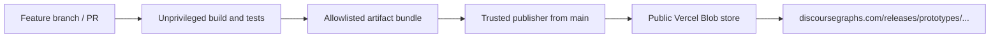

# Roam prototypes

## Start here

You don't need to be a developer to create a prototype.

1. Clone this repository to your computer. The easiest option is GitHub Desktop: choose **File > Clone repository**, select **URL**, and enter:

   ```text
   https://github.com/DiscourseGraphs/roam-prototypes
   ```

   Or clone it from a terminal:

   ```text
   git clone https://github.com/DiscourseGraphs/roam-prototypes.git
   ```

2. Open the cloned `roam-prototypes` folder in your LLM coding tool of choice.

3. Ask what you want in plain language. For example:

   > How do I create a prototype?

   or:

   > Can you create me a prototype that does XYZ?

The repository includes instructions for the assistant in [AGENTS.md](AGENTS.md). It should use the prototype generator, keep the work in the right place, and run the required checks. If it reports that Node, pnpm, or another prerequisite is missing, ask it to set up what it needs and continue.

Private source repository for Discourse Graphs' installable Roam developer-extension prototypes.

Each prototype lives in `prototypes/<prototype>/`. Development uses ordinary feature branches and pull requests. Build artifacts are intentionally public so Roam can load them with **Load Developer Extensions from URL**.

## Release URLs

Stable releases from `main`:

```text
https://discoursegraphs.com/releases/prototypes/<prototype>/
```

Pull-request previews:

```text
https://discoursegraphs.com/releases/prototypes/previews/<branch-slug>/<prototype>/
```

After a preview is published, the workflow adds the exact Roam loading URL to the pull request as a **Roam prototype previews** comment.

Branch slugs are lowercase. A slash becomes `--`, and other non-alphanumeric runs become `-`. For example, `agent/example-shell` becomes `agent--example-shell`.

Roam expects an installable release directory to contain:

- `extension.js`
- `README.md`

It may also contain:

- `extension.css`
- `CHANGELOG.md`

## Repository layout

```text
roam-prototypes/
├── packages/
│   └── extension-base/      # Shared configuration, template, and Roam guidance
├── prototypes/              # Generated prototype workspaces appear here
├── scripts/                 # Generator, validation, and trusted publishing
├── test/                    # Generator and deployment-contract tests
└── .github/workflows/
    ├── ci.yml
    └── publish.yml
```

An implemented prototype builds its public files into `prototypes/<prototype>/dist/`. The packaging step copies only the four allowlisted artifact names. A prototype without `package.json` is a placeholder; a prototype without `dist/extension.js` is non-installable and is not published.

## Create a prototype

Node 22 and pnpm 10.15.1 are the repository standards. From the repository root:

```text
pnpm install --ignore-scripts
pnpm create:prototype -- --name example --title "Example" --description "What the prototype explores."
```

Add `--spec path/to/SPEC.md` when a specification is available. The generator validates the slug, renders the canonical starter, declares the shared esbuild tooling, updates the pnpm workspace installation, and prints the build commands and release URLs. It also supports `--dry-run`, `--skip-install`, and `--adopt-existing`; see [CONTRIBUTING.md](CONTRIBUTING.md).

For an LLM, a sufficient request is: “Create prototype `<name>` using the repository generator.” Give it the title, public description, and specification when available. Repository instructions in [AGENTS.md](AGENTS.md) cover the rest.

## Deployment design



The CI workflow never receives deployment credentials. After CI succeeds, `publish.yml` runs from the trusted default branch, treats downloaded build artifacts as untrusted data, validates their names and contents, and uploads only public extension artifacts. It never executes code from the downloaded artifact.

Do not commit the token or any other credential. See [SECURITY.md](SECURITY.md) and [CONTRIBUTING.md](CONTRIBUTING.md).
