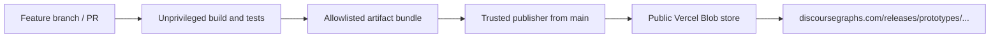

# Roam prototypes

Private source repository for Discourse Graphs' installable Roam developer-extension prototypes.

Each prototype lives in `prototypes/<prototype>/`. Development uses ordinary feature branches and pull requests. Build artifacts are intentionally public so Roam can load them with **Load Developer Extensions from URL**.

## Release URLs

Stable releases from `main`:

```text
https://discoursegraphs.com/releases/prototypes/<prototype>/
```

Pull-request previews:

```text
https://discoursegraphs.com/releases/prototypes/previews/<branch-slug>/<prototype>/
```

Branch slugs are lowercase. A slash becomes `--`, and other non-alphanumeric runs become `-`. For example, `agent/personal-homepage-shell` becomes `agent--personal-homepage-shell`.

Roam expects an installable release directory to contain:

- `extension.js`
- `README.md`

It may also contain:

- `extension.css`
- `CHANGELOG.md`

## Repository layout

```text
roam-prototypes/
├── prototypes/
│   └── personal-homepage/   # Reserved; implementation awaits an approved spec
├── scripts/                 # Artifact validation and trusted publishing
├── test/                    # Deployment-contract tests
└── .github/workflows/
    ├── ci.yml
    └── publish.yml
```

An implemented prototype builds its public files into `prototypes/<prototype>/dist/`. The packaging step copies only the four allowlisted artifact names. A prototype without `dist/extension.js` is treated as non-installable and is not published.

## Deployment design



The CI workflow never receives deployment credentials. After CI succeeds, `publish.yml` runs from the trusted default branch, treats downloaded build artifacts as untrusted data, validates their names and contents, and uploads only public extension artifacts. It never executes code from the downloaded artifact.

The repository must have a repository-level Actions secret named `BLOB_READ_WRITE_TOKEN`. The token must belong to the existing public Blob store used by `discoursegraphs.com/releases/*`.

```powershell
gh secret set BLOB_READ_WRITE_TOKEN --repo DiscourseGraphs/roam-prototypes
```

Do not commit the token or any other credential. See [SECURITY.md](SECURITY.md) and [CONTRIBUTING.md](CONTRIBUTING.md).

